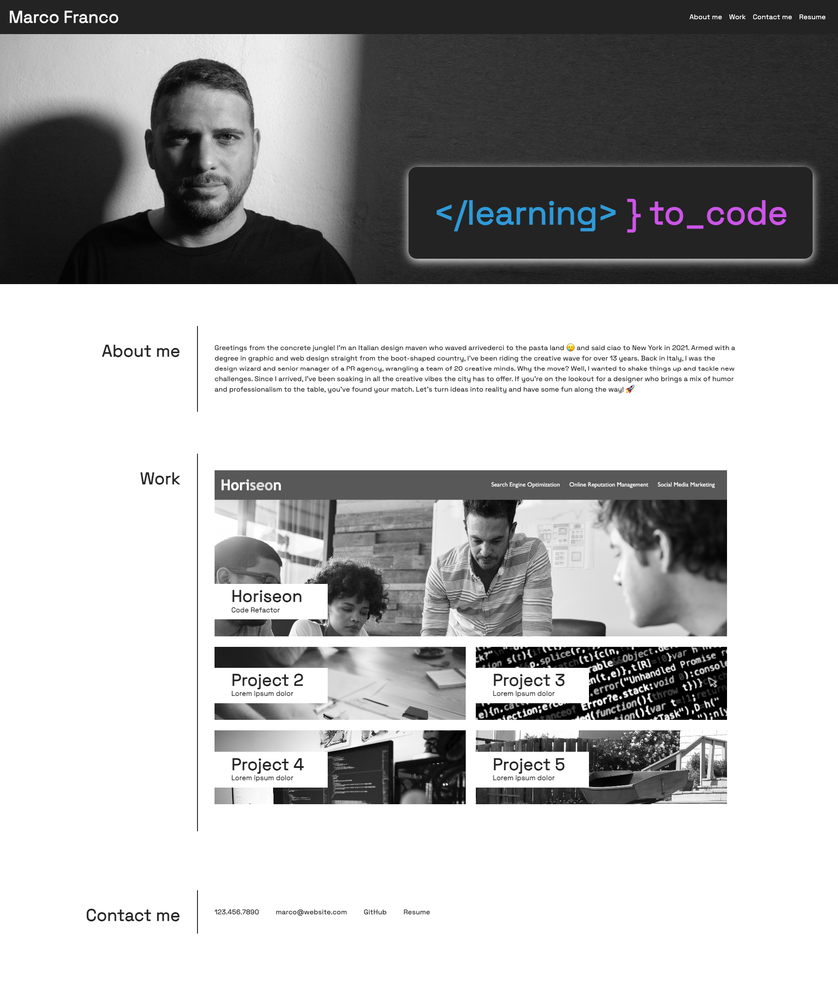
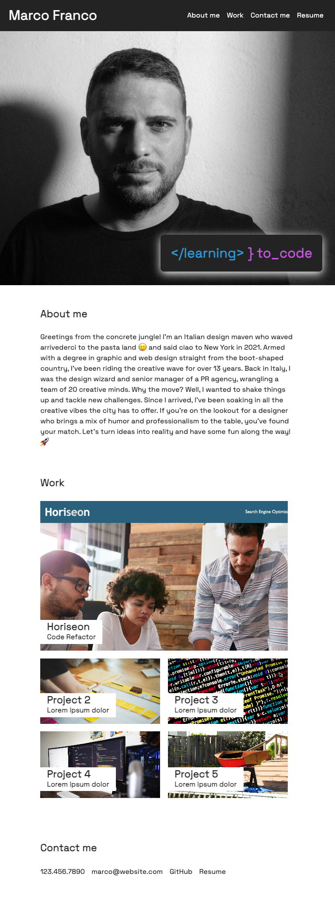
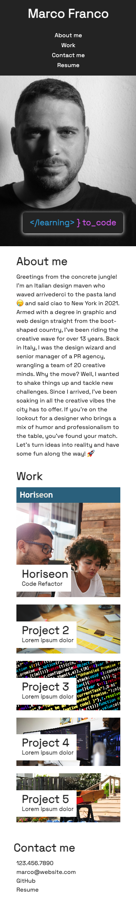

# Marco Franco • Portfolio website

## Project Description
Welcome to my portfolio! I built this website to showcase my skills, experiences, and projects, motivated by the goal of establishing a digital presence and presenting my work in a clear and accessible way. The project addresses the challenge of effectively communicating my diverse skill set to potential employers and collaborators.

Through this endeavor, I learned valuable lessons in web design and development, emphasizing the balance between aesthetics and functionality. This portfolio is a reflection of my growth as a professional, highlighting my commitment to continuous learning in the dynamic world of digital communication. Explore and enjoy getting to know me better!

## Mock-Up

The following gif shows the web application's appearance and functionality:

The following image shows the web application's appearance on desktops' screen:

The following image shows the web application's appearance on tablets' screen:

The following image shows the web application's appearance on smartphones' screen:

## Credits
[w3schools.com](https://www.w3schools.com/)

## Repository and Webpage link

- [Repository Link](https://github.com/marphco/marco-franco-portfolio)
- [Webpage Link](https://marphco.github.io/marco-franco-portfolio/)